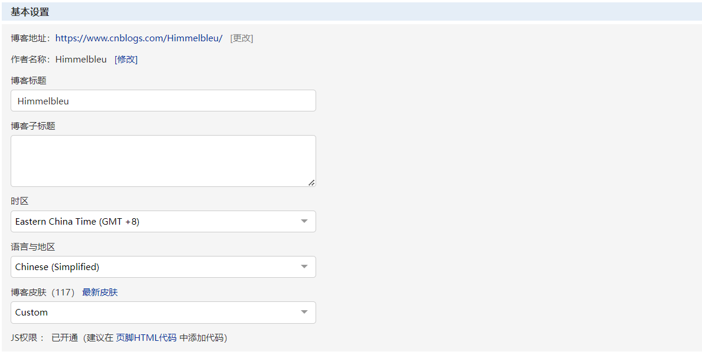
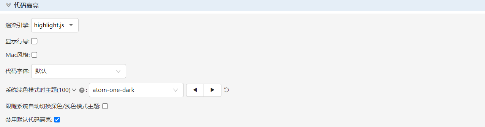
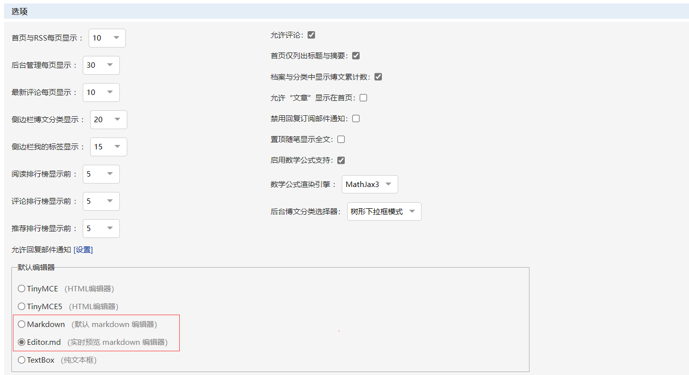
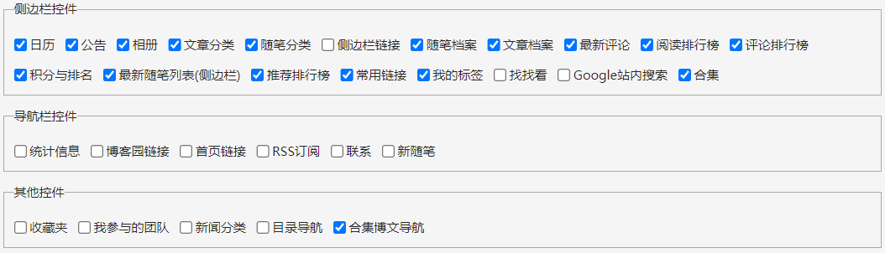

<p align="center">CNBLOGS-THEME-BLEU</p>

<p align="center">
一个简单的博客主题。支持数学公式、部分数据有图表统计、部分可配置。
</p>

<p align="center">
快速预览：https://www.cnblogs.com/himmelbleu
</p>

[](https://github.com/himmelbleu/cnblogs-theme-bleu/releases)

## 特性

- 界面简洁优雅，响应式网页设计。
- 轻量配置，非常容易使用。
- 提供暗黑模式和多种色彩主题，可随时切换。
- 支持自定义导航栏菜单项、悬浮标题目录等。
- 项目结构清晰，代码简单，可实现高度定制化开发。

## 开发

```bash
# 克隆代码
git clone git@github.com:Himmelbleu/cnblogs-theme-bleu.git

# 进入目录
cd cnblogs-theme-silence

# 安装依赖
pnpm install

# 本地调试
pnpm start

# 编译发布
pnpm run build
```

# 开始配置

## 基本设置



- 开启 JS 权限。
- 博客皮肤请选择 Custom。

## 代码高亮



- 禁用默认代码高亮。
- 其余设置可选，但用处不大。

## 博客选项



- 数学公式必须选择 MathJax3。
- 其余的选项可以自行设置。

## 控件设置



- 控件选项仅供参考。

## 页首 HTML 代码

```html
<script>
  $("head > link").remove();
  $("#top_nav").remove();
</script>

<link
  rel="stylesheet"
  href="https://blog-static.cnblogs.com/files/blogs/666252/index-bleu.css?t=202306172" />
<link rel="stylesheet" href="//cdn.jsdelivr.net/npm/hack-font@3.3.0/build/web/hack-subset.css" />

<style>
  #home {
    display: none !important;
  }

  .loading {
    z-index: 9999999;
    background-color: #222222;
    position: relative;
    height: 100vh;
    width: 100vw;
    display: flex;
    flex-wrap: nowrap;
    flex-direction: row;
    align-content: center;
    justify-content: center;
    align-items: center;
  }

  .triangle1 {
    width: 0;
    height: 0;
    border-style: solid;
    border-width: 4rem 4rem 0 0;
    border-color: #354952 transparent transparent transparent;
    margin: 0 auto;
    animation: triangle1-start 1s ease-in-out infinite normal;
  }

  .triangle2 {
    width: 0;
    height: 0;
    border-style: solid;
    border-width: 0 0 4rem 4rem;
    border-color: transparent transparent #df1a54 transparent;
    margin: -4rem auto 0;
    animation: triangle2-start 1s ease-in-out infinite alternate;
  }

  @keyframes triangle1-start {
    0% {
      transform: rotate(-360deg);
    }

    100% {
    }
  }

  @keyframes triangle2-start {
    0% {
      transform: rotate(360deg);
    }

    100% {
    }
  }

  .text {
    color: #a7a7a7;
    font-weight: 100;
    text-align: center;
    margin-top: 3rem;
    letter-spacing: 0.8rem;
  }
</style>

<div class="loading">
  <div>
    <div class="triangle1"></div>
    <div class="triangle2"></div>
    <h4 class="text">loading</h4>
  </div>
</div>
```

## 页脚 HTML 代码

```html
<script>
  // 主题的配置对象
  window.__BLEU_CONFIG__ = {};
</script>
<script
  type="module"
  src="https://blog-static.cnblogs.com/files/blogs/666252/index-bleu.js?t=202306172"></script>

<!-- 鼠标特效 -->
<script src="https://blog-static.cnblogs.com/files/yjlblog/cursor-effects.js"></script>
```

# 配置主题

## icon

- 类型：string
- 是否必填：否

网站 icon，显示在浏览器标签页。

```js
window.__BLEU_CONFIG__ = {
  icon: ""
};
```

## signature

- 类型：string
- 是否必填：是

个性签名显示在博客信息底部，文字超过两行会被隐藏（出于布局的考虑）。

```js
window.__BLEU_CONFIG__ = {
  signature: "Time tick away, dream faded away."
};
```

## avatar

- 类型：string
- 是否必填：否

个人头像显示在博客信息顶部，请插入不宜过大的网络图片。

```js
window.__BLEU_CONFIG__ = {
  avatar: ""
};
```

## images

- 类型：object
- 是否必填：是

该配置项包括了背景图片、首页轮播图、文章和随笔列表封面图。

```js
window.__BLEU_CONFIG__ = {
  images: {
    // 背景
    bg: {
      // 网络图片
      src: ""
      // 透明度
      opacity: 0.03,
      // 同 css background-size
      size: "50% auto",
      // 同 css background-repeat
      repeat: "repeat"
    },
    // 首页轮播图
    home: {
      // 透明度
      opacity: 0.5,
      // 轮播间隔，单位毫秒
      interval: 5000,
      // 轮播列表
      carousel: [
        ""
      ],
      // 是否开启轮播图，不开启就不显示轮播图
      disabled: true
    },
    // 随笔和文章列表封面图
    arbeiten: [
      ""
    ]
  }
};
```

随笔和文章列表封面图不超过 10 个时，会重复看到图片。首页轮播图不开启时，以第二种布局代替轮播图位置。

## chart

- 类型：object
- 是否必填：是

我的技能、随笔分类、我的标签的图表统计。

其中，我的技能雷达图完全符合 echart 雷达图的配置。

```js
window.__BLEU_CONFIG__ = {
  chart: {
    // 我的技能，该属性和 echart 雷达图配置完全一致，可以参考官方文档来填写
    tech: {},
    // 我的标签饼状图统计前 count 个，可以不填，默认 10 个
    mark: {
      count: 12
    },
    // 随笔分类饼状图统计前 count 个，可以不填，默认 10 个
    category: {
      count: 12
    }
  }
};
```

## font

- 类型：object
- 是否必填：否

配置主题的字体，默认字体使用 Element-Plus 的字体集。你可以配置你自己喜欢的字体。

1. 在“页首 HTML 代码”处插入一个字体 cdn 或者字体网址的 link 标签，表示引入字体到博客中。
2. 得到字体名称。
3. 在配置文件中配置。

页首 HTML 代码：

```html
<link rel="stylesheet" href="https://fonts.loli.net/icon?family=ZCOOL+KuaiLe" />
<link
  rel="stylesheet"
  href="https://cdn.bootcdn.net/ajax/libs/hack-font/3.3.0/web/hack-subset.min.css" />
<link
  rel="stylesheet"
  href="https://cdn.bootcdn.net/ajax/libs/lxgw-wenkai-webfont/1.6.0/style.min.css" />
```

字体有三处配置：

（1）主要字体：所看见的绝大部分文字都是主要字体。

（2）代码字体：代码块中的字体。

（3）艺术字体：标题，菜单栏的字体。

```js
window.__BLEU_CONFIG__ = {
  font: {
    code: {
      name: "Hack, LXGW WenKai",
      size: "0.8rem"
    },
    main: {
      name: "LXGW WenKai"
    },
    art: {
      name: "ZCOOL KuaiLe",
      size: "1.2rem"
    }
  }
};
```

## 完整配置

```html
<script>
  // 主题的配置对象
  window.__BLEU_CONFIG__ = {
    icon: "",
    signature: "Time tick away, dream faded away.",
    avatar: "",
    images: {
      bg: {
        src: ""
        opacity: 0.03,
        size: "50% auto",
        repeat: "repeat"
      },
      home: {
        opacity: 0.5,
        interval: 5000,
        carousel: [
          ""
        ],
        disabled: true
      },
      arbeiten: [
        ""
      ]
    },
    chart: {
      tech: {
        radar: {
          indicator: [
            { name: "Vue", max: 5 },
            { name: "React", max: 5 },
            { name: "JS", max: 5 },
            { name: "TS", max: 5 },
            { name: "Python", max: 5 },
            { name: "C", max: 5 },
            { name: "Java", max: 5 },
            { name: "MySQL", max: 5 },
            { name: "Mybatis", max: 5 }
          ]
        },
        series: [
          {
            tooltip: {
              trigger: "item"
            },
            areaStyle: {},
            type: "radar",
            data: [
              {
                value: [4, 1, 4, 3, 3.5, 1, 3.5, 2.5, 3.5],
                name: "技能掌握程度"
              }
            ]
          }
        ]
      },
      mark: {
        count: 12
      },
      category: {
        count: 12
      }
    },
    font: {
      code: {
        name: "Hack, LXGW WenKai",
        size: "0.8rem"
      },
      main: {
        name: "LXGW WenKai"
      },
      art: {
        name: "ZCOOL KuaiLe",
        size: "1.2rem"
      }
    }
  };
</script>
```
