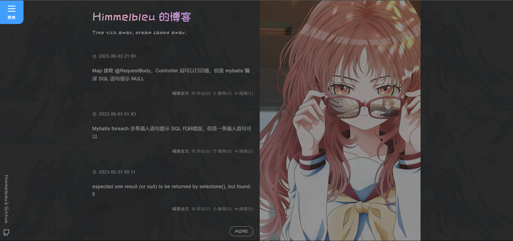
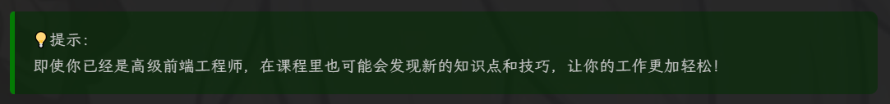

# Bleu 主题

一个简单的博客皮肤，基于 Vite、Vue3、UnoCSS 开发。支持数学公式、部分数据有图表统计、部分可配置。





# 开始配置

## 基本设置


- 开启 JS 权限。
- 博客皮肤请选择 Custom。

## 代码高亮


- 禁用默认代码高亮。
- 其余设置可选，但用处不大。

## 博客选项


- 数学公式必须选择 MathJax3。
- 其余的选项可以自行设置。

## 控件设置


- 控件选项仅供参考。

## 页首 HTML 代码

```html
<script>
  $("head > link").remove();
  $("#top_nav").remove();
</script>

<link
  rel="stylesheet"
  href="https://blog-static.cnblogs.com/files/blogs/666252/index-bleu.css?t=202306172" />
<link rel="stylesheet" href="//cdn.jsdelivr.net/npm/hack-font@3.3.0/build/web/hack-subset.css" />

<style>
  #home {
    display: none !important;
  }

  .loading {
    z-index: 9999999;
    background-color: #222222;
    position: relative;
    height: 100vh;
    width: 100vw;
    display: flex;
    flex-wrap: nowrap;
    flex-direction: row;
    align-content: center;
    justify-content: center;
    align-items: center;
  }

  .triangle1 {
    width: 0;
    height: 0;
    border-style: solid;
    border-width: 4rem 4rem 0 0;
    border-color: #354952 transparent transparent transparent;
    margin: 0 auto;
    animation: triangle1-start 1s ease-in-out infinite normal;
  }

  .triangle2 {
    width: 0;
    height: 0;
    border-style: solid;
    border-width: 0 0 4rem 4rem;
    border-color: transparent transparent #df1a54 transparent;
    margin: -4rem auto 0;
    animation: triangle2-start 1s ease-in-out infinite alternate;
  }

  @keyframes triangle1-start {
    0% {
      transform: rotate(-360deg);
    }

    100% {
    }
  }

  @keyframes triangle2-start {
    0% {
      transform: rotate(360deg);
    }

    100% {
    }
  }

  .text {
    color: #a7a7a7;
    font-weight: 100;
    text-align: center;
    margin-top: 3rem;
    letter-spacing: 0.8rem;
  }
</style>

<div class="loading">
  <div>
    <div class="triangle1"></div>
    <div class="triangle2"></div>
    <h4 class="text">loading</h4>
  </div>
</div>
```

## 页脚 HTML 代码

```html
<script>
  window.__BLEU_CONFIG__ = {
    signature: "Time tick away, dream faded away.",
    avatar: "",
    images: {
      bg: {
        src: ""
        opacity: 0.03,
        size: "50% auto",
        repeat: "repeat"
      },
      home: {
        opacity: 0.5,
        interval: 5000,
        carousel: [
          ""
        ],
        disabled: true
      },
      arbeiten: [
        ""
      ]
    },
    chart: {
      tech: {
        radar: {
          indicator: [
            { name: "Vue", max: 5 },
            { name: "React", max: 5 },
            { name: "JS", max: 5 },
            { name: "TS", max: 5 },
            { name: "Python", max: 5 },
            { name: "C", max: 5 },
            { name: "Java", max: 5 },
            { name: "MySQL", max: 5 },
            { name: "Mybatis", max: 5 }
          ]
        },
        series: [
          {
            tooltip: {
              trigger: "item"
            },
            areaStyle: {},
            type: "radar",
            data: [
              {
                value: [4, 1, 4, 3, 3.5, 1, 3.5, 2.5, 3.5],
                name: "技能掌握程度"
              }
            ]
          }
        ]
      },
      mark: {
        count: 12
      }
    },
    font: {
      code: {
        name: "Hack, LXGW WenKai",
        size: "0.8rem"
      },
      main: {
        name: "LXGW WenKai"
      },
      art: {
        name: "ZCOOL KuaiLe",
        size: "1.2rem"
      }
    }
  };
</script>
<script
  type="module"
  src="https://blog-static.cnblogs.com/files/blogs/666252/index-bleu.js?t=202306172"></script>

<!-- 鼠标特效 -->
<script src="https://blog-static.cnblogs.com/files/yjlblog/cursor-effects.js"></script>
```
