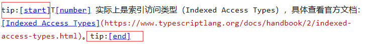
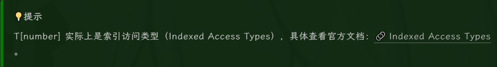

# Bleu 主题

一个简单的博客皮肤，基于 Vite、Vue3、UnoCSS 开发。支持数学公式、部分数据有图表统计、部分可配置。





# 开始配置

## 基本设置


- 开启 JS 权限。
- 博客皮肤请选择 Custom。

## 代码高亮


- 禁用默认代码高亮。
- 其余设置可选，但用处不大。

## 博客选项


- 数学公式必须选择 MathJax3。
- 其余的选项可以自行设置。

## 控件设置


- 控件选项仅供参考。

## 页首 HTML 代码

```html
<script>
  $("head > link").remove();
  $("#top_nav").remove();
</script>

<link
  rel="stylesheet"
  href="https://blog-static.cnblogs.com/files/blogs/666252/index-bleu.css?t=202306172" />
<link rel="stylesheet" href="//cdn.jsdelivr.net/npm/hack-font@3.3.0/build/web/hack-subset.css" />

<style>
  #home {
    display: none !important;
  }

  .loading {
    z-index: 99999;
    background-color: #222222;
    position: relative;
    height: 100vh;
    width: 100vw;
    display: flex;
    flex-items: center;
    jusitfy-content: center;
    flex-direction: row;
    flex-wrap: nowrap;
    align-content: center;
    justify-content: center;
    align-items: center;
  }

  /** loader **/
  .triangle1 {
    width: 0;
    height: 0;
    border-style: solid;
    border-width: 50px 50px 0 0;
    border-color: #354952 transparent transparent transparent;
    margin: 0 auto;
    animation: triangle1-start 1s ease-in-out infinite normal;
  }

  .triangle2 {
    width: 0;
    height: 0;
    border-style: solid;
    border-width: 0 0 50px 50px;
    border-color: transparent transparent #df1a54 transparent;
    margin: -50px auto 0;
    animation: triangle2-start 1s ease-in-out infinite alternate;
  }

  @keyframes triangle1-start {
    0% {
      transform: rotate(-360deg);
    }

    100% {
    }
  }

  @keyframes triangle2-start {
    0% {
      transform: rotate(360deg);
    }

    100% {
    }
  }

  .text {
    color: #a7a7a7;
    font-weight: 100;
    text-align: center;
    margin-top: 2rem;
    letter-spacing: 0.8rem;
  }
</style>

<div class="dark-loading loading">
  <div>
    <div class="triangle1"></div>
    <div class="triangle2"></div>
    <h4 class="text">loading</h4>
  </div>
</div>
```

## 页脚 HTML 代码

```html
<script>
  window.__BLEU_CONFIG__ = {
    icon: "https://images.cnblogs.com/cnblogs_com/blogs/666252/galleries/1934022/o_230424132322_1682316080648.jpg",
    avatar:
      "https://images.cnblogs.com/cnblogs_com/blogs/666252/galleries/1934022/o_230424132322_1682316080648.jpg",
    images: {
      home: {
        opacity: 0.5,
        interval: 10000,
        divider: "https://img.soogif.com/7Qhba91zLWe1Q55zyeCxw82hsSxH5UmG.gif",
        carousel: [
          "https://images.cnblogs.com/cnblogs_com/blogs/666252/galleries/2302503/o_230516162200_107971386_p0.jpg",
          "https://images.cnblogs.com/cnblogs_com/blogs/666252/galleries/2302503/o_230516162423_107512607_p0.jpg",
          "https://images.cnblogs.com/cnblogs_com/blogs/666252/galleries/2302503/o_230612175143_106701659_p0.jpg",
          "https://images.cnblogs.com/cnblogs_com/blogs/666252/galleries/2302503/o_230612175303_105169167_p0.jpg"
        ]
      },
      arbeiten: [
        "https://images.cnblogs.com/cnblogs_com/blogs/666252/galleries/2302503/o_230515171752_96831600_p2.jpg",
        "https://images.cnblogs.com/cnblogs_com/blogs/666252/galleries/2302503/o_230515171757_103174248_p0.jpg",
        "https://images.cnblogs.com/cnblogs_com/blogs/666252/galleries/2302503/o_230515171802_103174248_p1.jpg",
        "https://images.cnblogs.com/cnblogs_com/blogs/666252/galleries/2302503/o_230515171811_103174248_p2.jpg",
        "https://images.cnblogs.com/cnblogs_com/blogs/666252/galleries/2302503/o_230515171816_103174248_p4.jpg",
        "https://images.cnblogs.com/cnblogs_com/blogs/666252/galleries/2302503/o_230515171823_103174248_p8.jpg",
        "https://images.cnblogs.com/cnblogs_com/blogs/666252/galleries/2302503/o_230520141026_96189592_p0.png",
        "https://images.cnblogs.com/cnblogs_com/blogs/666252/galleries/2302503/o_230520141035_96189592_p1.png",
        "https://images.cnblogs.com/cnblogs_com/blogs/666252/galleries/2302503/o_230520141039_96189592_p2.png",
        "https://images.cnblogs.com/cnblogs_com/blogs/666252/galleries/2302503/o_230520141044_96831600_p0.jpg",
        "https://images.cnblogs.com/cnblogs_com/blogs/666252/galleries/2302503/o_230520141049_96831600_p1.jpg",
        "https://images.cnblogs.com/cnblogs_com/blogs/666252/galleries/2302503/o_230520141053_96831600_p3.jpg"
      ],
      bg: {
        src: "https://images.cnblogs.com/cnblogs_com/blogs/666252/galleries/2302503/o_230612174652_94471721_p0.jpg",
        opacity: 0.02
      }
    },
    chart: {
      tooltip: {
        trigger: "axis"
      },
      radar: [
        {
          indicator: [
            { name: "Vue", max: 5 },
            { name: "React", max: 5 },
            { name: "JS", max: 5 },
            { name: "TS", max: 5 },
            { name: "Python", max: 5 },
            { name: "C", max: 5 },
            { name: "Java", max: 5 }
          ]
        }
      ],
      series: [
        {
          tooltip: {
            trigger: "item"
          },
          areaStyle: {},
          type: "radar",
          data: [
            {
              value: [4, 1, 4, 3.5, 3.5, 1, 3.5],
              name: "技能掌握程度"
            }
          ]
        }
      ]
    },
    font: { main: "", code: "Hack" }
  };
</script>
<script
  type="module"
  src="https://blog-static.cnblogs.com/files/blogs/666252/index-bleu.js?t=202306172"></script>

<!-- 鼠标特效 -->
<script src="https://blog-static.cnblogs.com/files/yjlblog/cursor-effects.js"></script>
```
